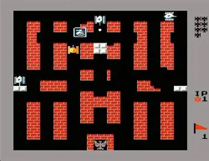
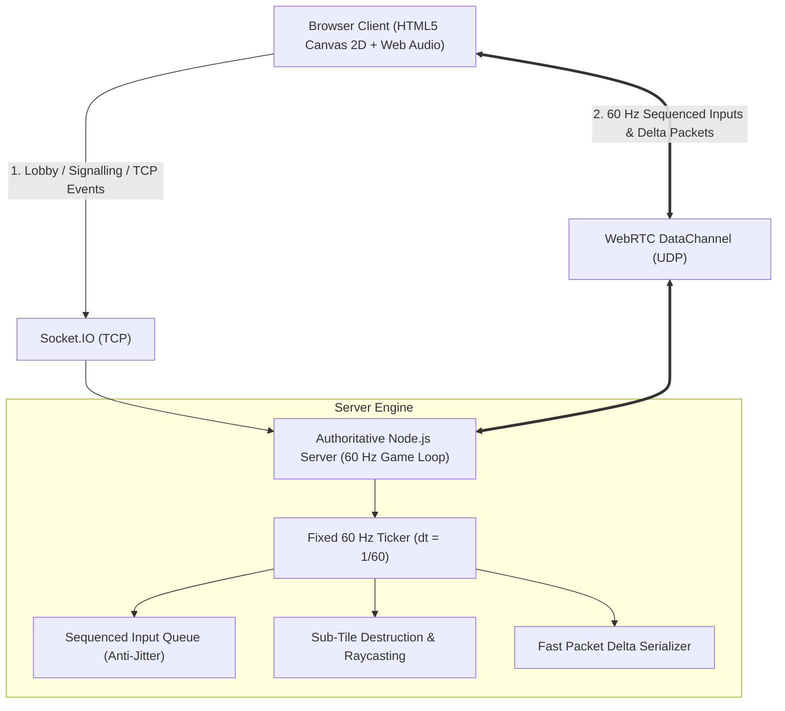
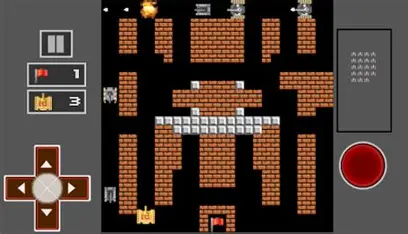
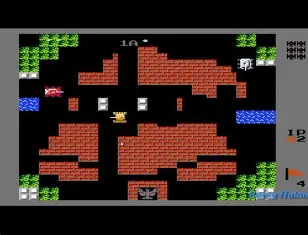

# 2D Multiplayer LAN Tank Combat Game ("Battle Tanks LAN")
## Architectural Blueprint & Technical Implementation Guide
*Extending LaneRacer's Authoritative 60 Hz UDP Networking, Sub-Tile Destruction, Multi-Team Modes, and Arena Map Specifications*

---

## 1. Executive Overview & Retro Game Research

The design is inspired by the iconic 1985 arcade/NES classic **Battle City** (and its popular competitive updates **Tank 1990** / **Tank Battalion** by Namco). 



### Iconic Gameplay Mechanics:
1. **Destructible Sub-Tile Grid**:
   - The map is structured into 32×32 pixel macro-blocks, each subdivided into a 2×2 grid of 16×16 sub-tiles.
   - When a tank shell strikes a brick block, it carves out only the impacted sub-tiles, enabling players to punch narrow sniper slits, breach walls gradually, and carve ambush corridors.
2. **Indestructible Steel / Concrete Blocks**:
   - Solid white blocks withstand standard tank shells, creating permanent tactical cover and chokepoints. Only high-tier heavy tanks (3–4 Star upgrade) can shatter steel.
3. **Terrain Variety**:
   - **Water**: Projectiles fly over freely, but tanks are blocked, creating natural moats and sniper channels.
   - **Bushes / Foliage**: Tanks and shells pass through unimpeded; tanks inside are visually concealed for stealth ambushes.
   - **Ice**: Low friction causes tanks to slide in their momentum vector before halting.
4. **The Eagle / Phoenix Base (Headquarters)**:
   - The team's or player's base is marked by a distinctive **Eagle / Phoenix emblem** surrounded by protective brick fortifications.
   - If an enemy shell hits the Eagle, it instantly transforms into ruins, and that team/player suffers **immediate defeat**.
5. **Shell-on-Shell Mid-Air Collisions**:
   - Direct projectile collisions cancel each other out in mid-air, allowing players to defensively shoot down incoming enemy shells.

```
       [BRICK]         [STEEL]         [WATER]         [BUSHES]         [THE EAGLE (HQ)]
       Destructible    Solid           Bullets cross,  Tanks hide,      1-hit team kill
       in quadrants    impenetrable    tanks blocked   bullets cross    instant loss
```

---

## 2. LaneRacer Architecture: Foundation for LAN Tank Combat

LaneRacer's engine provides the ideal infrastructure for an ultra-responsive, zero-lag 2D LAN action game:



### Components Reused from LaneRacer:
1. **Hybrid WebSockets + WebRTC UDP DataChannel (`webrtcManager.js`)**:
   - **Socket.IO (TCP)**: Lobby join, team selection, map choices, chat, and room state.
   - **WebRTC DataChannel (`rtcDataChannel` over UDP)**: 60 Hz sequenced client inputs and fast server state delta broadcasts (`fastPacket()`). If UDP is blocked on certain LANs, it gracefully falls back to Socket.IO.
2. **Authoritative 60 Hz Simulation with Sequence Buffers**:
   - Server simulates physics at fixed 60 Hz ticks (`dt = 1/60`).
   - Clients send redundant input batches (`sentInputs`: newest + 5 past unacknowledged inputs). A dropped UDP packet causes **zero input lag** because the next frame delivers the lost sequence.
3. **Zero-Lag Client-Side Prediction (`predict.js`)**:
   - Local tanks turn and move immediately upon keypress.
   - Client reconciliation resolves minor prediction errors smoothly against authoritative server snapshots (`SnapshotBuffer`).
4. **Procedural Web Audio Engine**:
   - Synthesizes retro chiptune audio in Web Audio API with zero external asset files. 8-bit noise blasts, square-wave firing sounds, engine hums, and a two-tone alarm siren when an Eagle HQ is under attack.

---

## 3. Game Modes & Team Setups



### Mode 1: Attack (Team Deathmatch / Elimination)
- **Objective**: Annihilate all tanks on opposing teams.
- **Victory Condition**: Last surviving tank (FFA) or last surviving team with active tanks.
- **Lives System**:
  - *Hardcore*: 1 life per player (sudden death).
  - *Arcade*: Shared team respawn ticket pool (e.g., 5 reserve tanks per team). When the pool is empty, destroyed players enter Spectator Mode.

### Mode 2: Attack + Defence (Eagle / Base Protection)
- **Objective**: Defend your team's Eagle HQ while destroying enemy Eagles.
- **The Eagle Entity**:
  - Each team (or each individual player in FFA) has an **Eagle HQ** positioned in their defensive territory.
  - If a team's Eagle is struck by a shell, the Eagle explodes, transforms into a ruin/graveyard sprite, and that entire team is immediately **ELIMINATED**!
- **Tactical Dynamics**:
  - Defenders must stay close to intercept incoming shells or block chokepoints.
  - Attackers can flank through forests or blast through brick walls to snipe the enemy Eagle.
  - "Iron Wall" powerup can temporarily reinforce the Eagle's surrounding brick wall into solid steel.

### Scalable Team Configurations:
| Configuration | Team Setup | Base Positions | Spawn Coordinates |
| :--- | :--- | :--- | :--- |
| **1v1 Duel** | Player 1 vs Player 2 | Bottom-Center vs Top-Center | Opposite ends of the map |
| **1v1v1... FFA (up to 8 players)** | Every tank for themselves | 1 Eagle per player in designated sectors | Perimeter spawns |
| **2 Teams (Red vs Blue)** | 2v2, 3v3, up to 8v8 | Red HQ at Bottom, Blue HQ at Top | Team defense zones |
| **3 Teams (Triangular)** | Red vs Blue vs Green | South, Northwest, Northeast | 3-way symmetric map |
| **4 Teams (Quadrants)** | Red, Blue, Green, Yellow | 4 Corners (TL, TR, BL, BR) | 4-quadrant symmetric map |
| **N Teams** | Dynamically allocated | Evenly spaced along perimeter | Sector-based spawns |

---

## 4. Map & Tile Physics Architecture



### The Dual-Grid Resolution Model
To faithfully reproduce destructible brick walls without heavy computational overhead, the game uses a **Dual-Grid model**:
- **Macro Grid**: 26×26 blocks (each block is 32×32 screen pixels).
- **Sub-Tile Micro Grid**: Each block is subdivided into a 2×2 grid of 16×16 sub-tiles (total map resolution: 52×52 micro-tiles).

```
   1 Macro Tile (32x32px)
   +----------+----------+
   | Sub (0,0)| Sub (1,0)|   <- When a shell strikes from the left,
   +----------+----------+      only Sub(0,0) and Sub(0,1) are destroyed!
   | Sub (0,1)| Sub (1,1)|      A narrow tunnel is created!
   +----------+----------+
```

### Tile Types & Physical Properties
| Tile ID | Name | Physical Behavior | Shell Interaction | Tank Interaction |
| :---: | :--- | :--- | :--- | :--- |
| `0` | **Empty Ground** | Walkable | Shell passes freely | Tank moves normally |
| `1` | **Brick Wall** | Destructible in 16×16 sub-tiles | Shell destroys sub-tile & detonates | Blocks tank movement |
| `2` | **Steel Block** | Solid indestructible | Shell detonates without damage | Blocks tank movement |
| `3` | **Water** | Liquid hazard | Shell flies over water freely | Blocks tank movement |
| `4` | **Foliage / Forest** | Concealment | Shell passes through freely | Tank enters & becomes hidden |
| `5` | **Ice** | Low friction | Shell passes freely | Tank slides in momentum vector |
| `9` | **Eagle HQ** | Critical Target | **1 hit = Team Instant Defeat** | Blocks tank movement |

### Sub-Tile Destruction Bitmask
Each brick macro-tile stores a 4-bit mask representing its 4 sub-quadrants:
```javascript
// Bitmask representation of a 2x2 brick block
// Bit 0: Top-Left (0b0001)
// Bit 1: Top-Right (0b0010)
// Bit 2: Bottom-Left (0b0100)
// Bit 3: Bottom-Right (0b1000)

function damageBrick(blockMask, hitDirection) {
    if (hitDirection === 'UP') {
        // Shell moving UP strikes bottom sub-tiles first
        return blockMask & ~0b1100;
    } else if (hitDirection === 'DOWN') {
        // Shell moving DOWN strikes top sub-tiles first
        return blockMask & ~0b0011;
    } else if (hitDirection === 'LEFT') {
        // Shell moving LEFT strikes right sub-tiles first
        return blockMask & ~0b1010;
    } else if (hitDirection === 'RIGHT') {
        // Shell moving RIGHT strikes left sub-tiles first
        return blockMask & ~0b0101;
    }
    return blockMask;
}
```

---

## 5. Map Arena Specifications (Including 2 New Custom Arenas)

### Map 1: Classic Fortress ("The Citadel")
*Traditional rectangular grid with urban street layout, fortified central corridors, and perimeter bases.*

---

### Map 2: Stadium / Pill Arena ("The Velocity Oval")
**Geometry**: **Half-circle (left curved loop) + 2 parallel straights (top & bottom) + half-circle (right curved loop)**.

```
       ======================= TOP STRAIGHT =======================
      /  [STEEL]   [BRICK]   [WATER MOAT]   [BRICK]   [STEEL]      \
    /     ====================================================      \
   |  [EAGLE 1]              [CENTRAL DIVIDER ISLAND]           [EAGLE 2]|
   | (Team Red)              [BRICK CROSS-CORRIDOR]            (Team Blue)|
    \     ====================================================      /
      \  [STEEL]   [FOREST]  [ICE CHANNEL]  [FOREST]  [STEEL]      /
       ====================== BOTTOM STRAIGHT =====================
```

#### Key Design Features:
1. **Two Parallel High-Speed Corridors**:
   - **Top Straight ("Sniper Alley")**: Flanked by a water moat on the inside. Bullets can be fired across the moat to snipe tanks traveling in the central aisle!
   - **Bottom Straight ("Ambush Trench")**: Flanked by dense forest patches and ice tracks. Tanks can accelerate quickly and slide through ice turns into surprise attacks.
2. **Dual Semicircle Loops**:
   - The left and right semicircles act as high-speed turnaround loops connecting the two straights.
   - Semicircular walls are composed of alternating steel pillars and destructible brick barricades.
3. **Central Island & Cross-Corridor**:
   - A central island divides the top and bottom straights, preventing cheap cross-map spawn snipes.
   - A destructible brick cross-cut in the center allows daring players to cut straight through from the top to bottom corridor.
4. **Game Mode Deployments**:
   - **Attack (Deathmatch)**: Tanks circle the stadium, engaging in high-speed lateral duels and utilizing the semicircles to loop behind pursuers.
   - **Attack + Defence (Base Protection)**:
     - **2 Teams**: Team Red Eagle HQ is fortified inside the Left Semicircle; Team Blue Eagle HQ is fortified inside the Right Semicircle. Attackers must choose whether to assault through the Top Straight, Bottom Straight, or breach the central island.
     - **4 Teams**: Spawns and Eagle bases placed at the 4 entrance corners (Top-Left, Bottom-Left, Top-Right, Bottom-Right).

---

### Map 3: Colosseum / Circular Arena ("The Orbital Ring")
**Geometry**: **Full Circle / Concentric Rings with Radial Spokes**.

```
                           [NORTH EAGLE / TEAM 1]
                                 === 12:00 ===
                           /                      \
                 [OUTER RING - ICE TRACK]           \
               /                                      \
     [WEST EAGLE] === [MIDDLE RING - BRICK] === [EAST EAGLE]
       (09:00)   |                                |   (03:00)
                 |        [INNER CORE MOAT]       |
                 |      [CENTRAL POWERUP HUB]     |
                 |                                |
               \                                      /
                 \                                  /
                           \                      /
                                 === 06:00 ===
                           [SOUTH EAGLE / TEAM 2]
```

#### Key Design Features:
1. **Concentric Ring Corridors**:
   - **Outer Ring**: A wide circular perimeter fitted with ice patches along the curves, enabling high-speed drift maneuvers and flanking runs around the entire perimeter.
   - **Middle Ring**: A maze of dense destructible brick fortifications and steel bunkers.
   - **Inner Core**: A fortified circular sanctum surrounded by a water moat, containing top-tier powerup drops (3-Star gun upgrade, Shovel base reinforcer).
2. **Radial Spoke Gateways**:
   - 8 radial corridors connect the Outer, Middle, and Inner rings (at 12:00, 1:30, 3:00, 4:30, 6:00, 7:30, 9:00, 10:30).
   - Gates are barricaded by destructible brick walls that can be breached to open new lines of sight.
3. **Omni-Directional Base Layouts (2, 3, 4, or 8 Teams)**:
   - **2 Teams**: North (12:00) vs. South (06:00).
   - **3 Teams**: 12:00 (Red), 04:00 (Blue), 08:00 (Green).
   - **4 Teams**: 12:00 (Red), 03:00 (Blue), 06:00 (Green), 09:00 (Yellow).
   - **FFA (8 Players)**: 8 Eagle bases stationed along the outer radial gates.
4. **Tactical Dynamic**:
   - Controlling the center gives snipers line-of-sight down multiple radial spoke corridors to strike enemy bases, but the center is vulnerable to being surrounded from all 360 degrees.

---

## 6. Authoritative Network Protocol

Sent by the server to all clients at 60 Hz over WebRTC DataChannel (or Socket.IO fallback):

```json
{
    "seq": 14502,
    "time": 24.18,
    "tanks": [
        { "id": "p1", "x": 128.5, "y": 256.0, "dir": 0, "moving": true, "alive": true, "shield": false },
        { "id": "p2", "x": 384.0, "y": 64.0, "dir": 2, "moving": false, "alive": true, "shield": true }
    ],
    "shells": [
        { "id": 401, "x": 128.5, "y": 210.0, "dir": 0 }
    ],
    "gridDiffs": [
        { "tileIdx": 142, "mask": 3 }
    ],
    "events": [
        { "type": "SHELL_EXPLODE", "x": 128.5, "y": 200.0 },
        { "type": "BASE_HIT", "teamId": "team-blue" }
    ]
}
```

---

## 7. Concrete Code Implementations of Critical Systems

### 7.1 Authoritative Sub-Tile Collision & Destruction (`MapManager.js`)
```javascript
class MapManager {
    constructor(cols = 26, rows = 26, tileSize = 32) {
        this.cols = cols;
        this.rows = rows;
        this.tileSize = tileSize;
        this.subSize = tileSize / 2; // 16px
        // 0: empty, 1: brick, 2: steel, 3: water, 4: bush, 5: ice, 9: eagle
        this.grid = new Uint8Array(cols * rows);
        // Bitmask for brick blocks: 4 bits per macro-block (0b1111 = all 4 quarters intact)
        this.brickMasks = new Uint8Array(cols * rows).fill(0b1111);
        this.eagles = new Map(); // teamId -> { col, row, alive }
    }

    damageAt(worldX, worldY, dir, canPierceSteel = false) {
        const col = Math.floor(worldX / this.tileSize);
        const row = Math.floor(worldY / this.tileSize);
        if (col < 0 || col >= this.cols || row < 0 || row >= this.rows) return { hit: true, solid: true };

        const idx = row * this.cols + col;
        const type = this.grid[idx];

        if (type === 0 || type === 4 || type === 5) {
            return { hit: false }; // Empty, bush, ice: shells pass through
        }

        if (type === 2) {
            // Steel block
            if (canPierceSteel) {
                this.grid[idx] = 0; // High-tier heavy shell obliterates steel
                return { hit: true, destroyed: true, diff: { idx, type: 0 } };
            }
            return { hit: true, solid: true }; // Deflected
        }

        if (type === 9) {
            // Eagle HQ hit!
            this.grid[idx] = 10; // Destroyed eagle ruins
            for (const [teamId, eagle] of this.eagles.entries()) {
                if (eagle.col === col && eagle.row === row) {
                    eagle.alive = false;
                    return { hit: true, baseDestroyed: teamId };
                }
            }
            return { hit: true, baseDestroyed: 'unknown' };
        }

        if (type === 1) {
            // Brick block sub-tile damage
            const localX = worldX - col * this.tileSize;
            const localY = worldY - row * this.tileSize;
            const subCol = localX >= this.subSize ? 1 : 0;
            const subRow = localY >= this.subSize ? 1 : 0;
            const subBit = 1 << (subRow * 2 + subCol);

            let mask = this.brickMasks[idx];
            if (mask & subBit) {
                // Destroy the quadrant hit
                mask &= ~subBit;
                this.brickMasks[idx] = mask;
                if (mask === 0) this.grid[idx] = 0; // Entire macro tile cleared
                return { hit: true, destroyed: true, diff: { idx, mask } };
            }
        }

        return { hit: false };
    }
}
```

### 7.2 Shell-on-Shell Collisions & Simulation (`ProjectileEngine.js`)
```javascript
class ProjectileEngine {
    constructor() {
        this.shells = [];
        this.nextId = 1;
    }

    spawnShell(tank) {
        const SPEED = 6.0; // pixels per tick
        let vx = 0, vy = 0, sx = tank.x, sy = tank.y;
        if (tank.dir === 'UP')    { vy = -SPEED; sy -= 18; }
        if (tank.dir === 'DOWN')  { vy =  SPEED; sy += 18; }
        if (tank.dir === 'LEFT')  { vx = -SPEED; sx -= 18; }
        if (tank.dir === 'RIGHT') { vx =  SPEED; sx += 18; }

        this.shells.push({
            id: this.nextId++,
            ownerId: tank.id,
            teamId: tank.teamId,
            x: sx,
            y: sy,
            vx,
            vy,
            dir: tank.dir,
            canPierceSteel: tank.tier >= 4
        });
    }

    update(mapManager, tanks, onEvent) {
        const toRemove = new Set();

        // 1. Movement & map collisions
        for (let i = 0; i < this.shells.length; i++) {
            const s = this.shells[i];
            s.x += s.vx;
            s.y += s.vy;

            const hitResult = mapManager.damageAt(s.x, s.y, s.dir, s.canPierceSteel);
            if (hitResult.hit) {
                toRemove.add(s.id);
                onEvent({ type: 'EXPLOSION', x: s.x, y: s.y, small: true });
                if (hitResult.baseDestroyed) {
                    onEvent({ type: 'BASE_DESTROYED', teamId: hitResult.baseDestroyed });
                }
            }
        }

        // 2. Shell vs. Shell mid-air collisions (cancel each other out)
        for (let i = 0; i < this.shells.length; i++) {
            for (let j = i + 1; j < this.shells.length; j++) {
                const a = this.shells[i], b = this.shells[j];
                if (toRemove.has(a.id) || toRemove.has(b.id)) continue;
                if (Math.hypot(a.x - b.x, a.y - b.y) < 14) {
                    toRemove.add(a.id);
                    toRemove.add(b.id);
                    onEvent({ type: 'EXPLOSION', x: (a.x + b.x) / 2, y: (a.y + b.y) / 2 });
                }
            }
        }

        // 3. Shell vs. Tank collisions
        for (const s of this.shells) {
            if (toRemove.has(s.id)) continue;
            for (const t of Object.values(tanks)) {
                if (!t.alive || t.id === s.ownerId || t.teamId === s.teamId) continue;
                if (Math.abs(s.x - t.x) < 14 && Math.abs(s.y - t.y) < 14) {
                    toRemove.add(s.id);
                    if (t.shieldUntil <= Date.now()) {
                        t.lives--;
                        if (t.lives <= 0) t.alive = false;
                        onEvent({ type: 'TANK_HIT', tankId: t.id, killed: !t.alive, killerId: s.ownerId });
                    }
                }
            }
        }

        this.shells = this.shells.filter(s => !toRemove.has(s.id));
    }
}
```

### 7.3 Smooth Grid-Snapping & Corner Assist (`TankPhysics.js`)
```javascript
function applyCornerAssist(tank, requestedDir, mapManager) {
    const TILE = mapManager.tileSize;
    const half = TILE / 2;

    if (requestedDir === 'UP' || requestedDir === 'DOWN') {
        // Nudge horizontal X to nearest tile center
        const nearestCenterX = Math.round((tank.x - half) / TILE) * TILE + half;
        const diffX = nearestCenterX - tank.x;
        if (Math.abs(diffX) <= 6) tank.x += Math.sign(diffX) * Math.min(Math.abs(diffX), 1.5);
    } else if (requestedDir === 'LEFT' || requestedDir === 'RIGHT') {
        // Nudge vertical Y to nearest tile center
        const nearestCenterY = Math.round((tank.y - half) / TILE) * TILE + half;
        const diffY = nearestCenterY - tank.y;
        if (Math.abs(diffY) <= 6) tank.y += Math.sign(diffY) * Math.min(Math.abs(diffY), 1.5);
    }
}
```

### 7.4 Web Audio Retro Sound Synthesizer (`RetroTankAudio.js`)
```javascript
export class RetroTankAudio {
    constructor() {
        this.ctx = null;
        this.master = null;
    }

    unlock() {
        if (this.ctx) return;
        this.ctx = new (window.AudioContext || window.webkitAudioContext)();
        this.master = this.ctx.createGain();
        this.master.gain.value = 0.5;
        this.master.connect(this.ctx.destination);
    }

    // 8-bit noise explosion for tank shell blasts & wall crumbles
    playExplosion(isBig = false) {
        if (!this.ctx) return;
        const dur = isBig ? 0.6 : 0.25;
        const buf = this.ctx.createBuffer(1, this.ctx.sampleRate * dur, this.ctx.sampleRate);
        const data = buf.getChannelData(0);
        for (let i = 0; i < data.length; i++) data[i] = (Math.random() * 2 - 1) * Math.exp(-i / (data.length * 0.3));

        const src = this.ctx.createBufferSource();
        src.buffer = buf;
        const filter = this.ctx.createBiquadFilter();
        filter.type = 'lowpass';
        filter.frequency.setValueAtTime(isBig ? 450 : 900, this.ctx.currentTime);
        filter.frequency.exponentialRampToValueAtTime(80, this.ctx.currentTime + dur);

        src.connect(filter).connect(this.master);
        src.start();
    }

    // Square wave retro shot
    playFire() {
        if (!this.ctx) return;
        const osc = this.ctx.createOscillator();
        const gain = this.ctx.createGain();
        osc.type = 'square';
        osc.frequency.setValueAtTime(440, this.ctx.currentTime);
        osc.frequency.exponentialRampToValueAtTime(110, this.ctx.currentTime + 0.12);
        gain.gain.setValueAtTime(0.3, this.ctx.currentTime);
        gain.gain.linearRampToValueAtTime(0, this.ctx.currentTime + 0.12);
        osc.connect(gain).connect(this.master);
        osc.start();
        osc.stop(this.ctx.currentTime + 0.12);
    }

    // Two-tone warning siren when Eagle HQ is under attack
    playEagleAlarm() {
        if (!this.ctx) return;
        const osc = this.ctx.createOscillator();
        const gain = this.ctx.createGain();
        osc.type = 'sawtooth';
        osc.frequency.setValueAtTime(880, this.ctx.currentTime);
        osc.frequency.setValueAtTime(440, this.ctx.currentTime + 0.15);
        gain.gain.setValueAtTime(0.35, this.ctx.currentTime);
        gain.gain.linearRampToValueAtTime(0, this.ctx.currentTime + 0.3);
        osc.connect(gain).connect(this.master);
        osc.start();
        osc.stop(this.ctx.currentTime + 0.3);
    }
}
```

---

## 8. Summary of Map Layouts & Implementation Roadmap

| Map Name | Primary Geometry | Key Tactical Elements | Optimal Team Modes |
| :--- | :--- | :--- | :--- |
| **The Citadel** | Classic Rectangular Grid | Narrow alleys, fortified center, perimeter Eagle HQs | 1v1, 2 Teams |
| **The Velocity Oval** | Semicircle + 2 Parallel Straights + Semicircle | High-speed lateral straights, water sniper moat, central breach | 2 Teams (Left vs Right), 4 Teams (Corners) |
| **The Orbital Ring** | Concentric Circles & 8 Radial Spokes | Outer ring ice drifting, middle ring cover, 360° center core powerup hub | 3 Teams, 4 Teams, 8-Player FFA |
